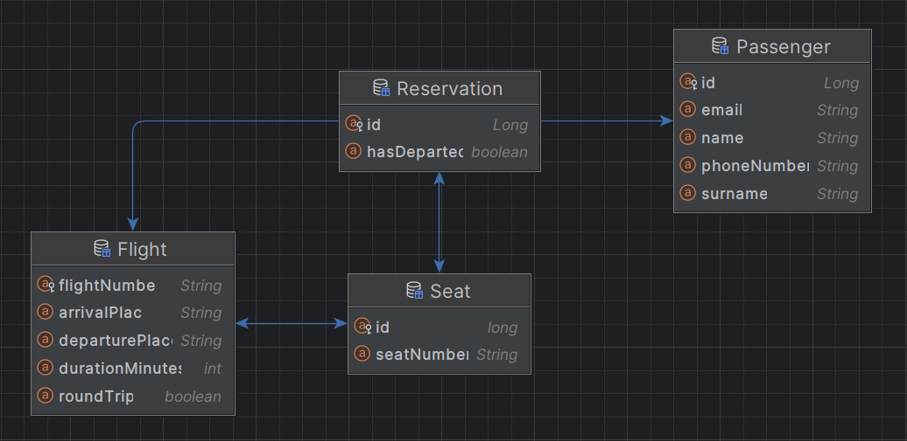

# System rezerwacji lotów

## Co zrobiłam?
- coś

## Jakie decyzje projektowe podjęłam?
- Długo zastanawiałam się nad tym co zrobić z numerem lotu, moje opcje to były:
  - Wprowadzić **id** (liczba) klasy i **numer lotu** (string) - id będące wartością unikalną, a numer lotu mogący się powtarzać. Tylko wtedy... czemu numer lotu nie rozróżnia lotu?
  - Dlatego myślałam nad tym by dodać datę wylotu i wtedy (data wylotu, numer lotu) stanowiłyby klucz unikalny, ale to skomplikowałoby system, który miał być prosty.
  - W końcu wybrałam po prostu unikalny numer lotu będący typu i usunęłam liczbowe id.
- Dla systemu wybrałam architekturę REST API oraz framework Spring Boot
- W klasie lotu dodałam siedzenia, które są własną odrębną klasą która pilnuje, żeby dane siedzenie nie było zarezerwowane przez innego pasażera. Nie implementowałam klasy samolotu a dopiero w niej miejsc siedzących - chociaż byłoby to takie piękne obiektowe podejście.

## Jak uruchomić projekt?

adasdas

## Możliwe 